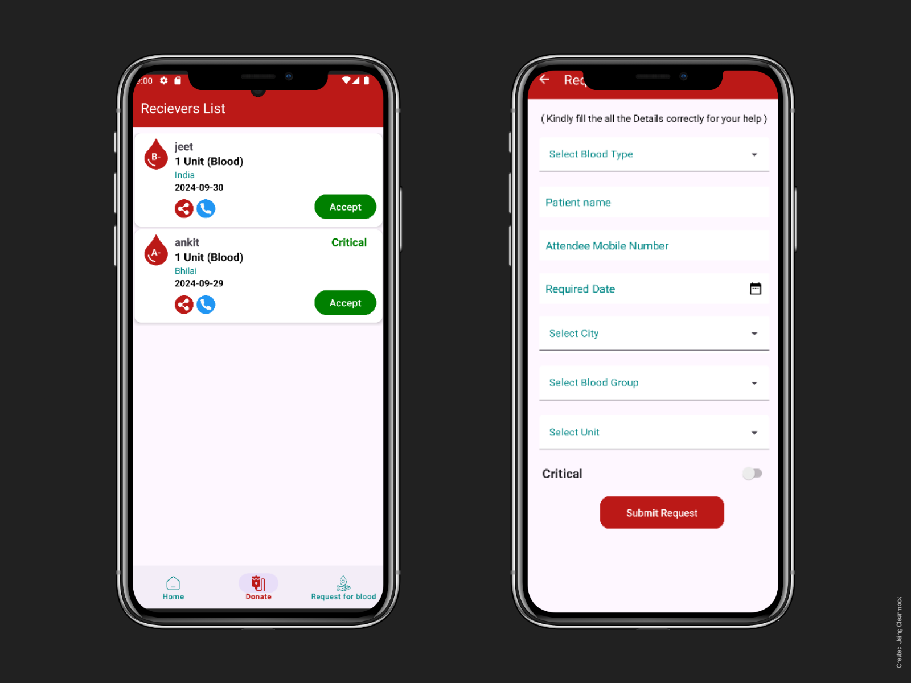

# BloodConnect-app 🚑🩸

**BloodConnect-app** is a mobile application that helps users **find blood donors in emergency situations**, **post blood-related needs**, and **help each other with life-saving support**. This app’s mission is to simplify the process of locating compatible blood donors and strengthen the community’s ability to respond during urgent needs.

Based on open-source principles, BloodConnect encourages developers and contributors to help build and improve this tool. :contentReference[oaicite:0]{index=0}

---

## 📌 Features

✅ **Emergency Blood Search**  
Search for available blood donors by blood type and location.

✅ **Post Blood Requirements**  
Create and share urgent requests to notify nearby donors.

✅ **Community Driven**  
Users support each other in critical situations by sharing and responding to needs. :contentReference[oaicite:1]{index=1}

---

## 📱 App Screenshots

### Home Screen
.png)

### Search Blood Donor


### Login And OTP


### Register


---

## 🛠️ Built With

This Android app is built using:

- **Kotlin**
- Android SDK
- Gradle build system
- Firebase
- xml

---

## 🚀 Getting Started


   ```bash
   git clone https://github.com/Absaw2005/BloodConnect-app.git
